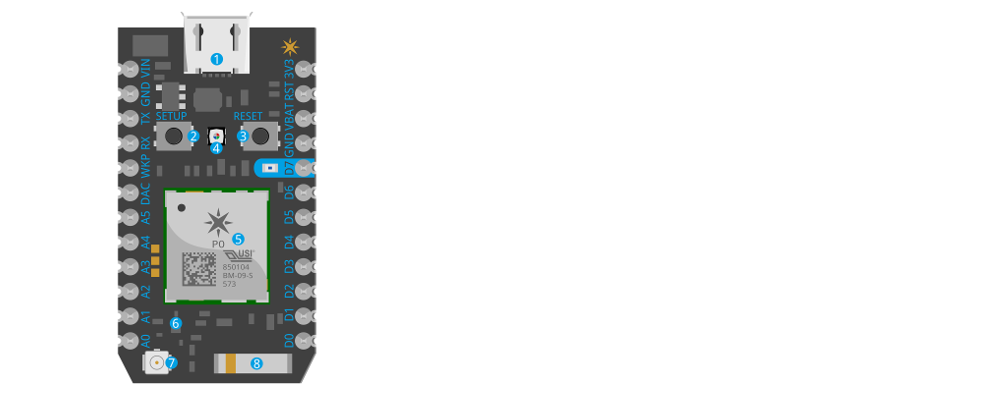

# Introduction au Photon

**(en cours de rédaction mai 2020)**

# 💅 . 

## Introduction

«Photon», c'est une carte électronique facilement programmable pour tester des prototypes d'objets interactifs connectés. Les Photons sont capables d'envoyer et de recevoir des données en wifi. On peut les utiliser dans le cadre d'un réseau local, ou les connecter à internet, au cloud. 

Connectés à internet, il devient possible de :
* programmer la carte à distance,
* déclencher des actions à distance (ex : allumer un appareil, chosiir la couleur d'une lampe),
* recevoir, stocker, afficher des données produites par une carte Photon et un/plusieurs capteur(s) associé(s) (ex: données météo)

En plus de la carte électronique, moyennant la création d'un compte, Particle (fabricant) donne l'accès à un cloud, à un environnement de programmation dans le navigateur (IDE), à diverses applicaitons et à une documentation très complète.

  
### Quel rapport entre Arduino et Photon

Ce sont deux variantes de cartes programmables, pratiques pour créer des prototypes, avec une documentation et des tutoriels adaptés pour l'apprentissage. Le projet Arduino est principalement orienté sur l'électronique interactive, alors que Photon est consacré à la découverte des principes de «l'internet des objets» (communication sans fil, cloud, wifi).
  
La carte Photon se programme sans fil (ce qui permet aussi de la programmer sans être dans le même lieu!), alors qu'en général l'Arduino se programme par une connexion USB-série. Le code qui permet de programmer la carte Photon est similaire à celui utilisé sur Arduino, il est donc possible de passer très rapidement d'une carte à l'autre, selon les besoins. 
  
Pour la partie électronique, le microcontrôleur (= «le cerveau de la carte» qui équipe l'arduino fait partie de la série ATMega 8bits de Microchip, alors que le Photon est équipé d'un microcontrôleur ARM Cortex M3 32bits, plus puissant ainsi que d'un circuit spécialisé pour la partie wifi (TODO voir plus loin pour des explications précises).

### Pré-requis

Cette introduction à Photon requiert que vous soyez déjà initié à l'électronique interactive :
* bases de l'électronique : résistance, tension, signal, masse, etc.
* programmation de carte électronique à microcontrôleur comme Arduino,
* principes d'entrée/sortie binaire (Digital In / Digital Out) 
* principes d'entrée/sortie analogiques (Analog In / Analog Out)

### Qui produit les cartes Photon ?

C'est la société américaine [Particle](https://www.particle.io/) qui fabrique et vend les cartes Photon. Il s'agit de la 2e génération de circuits (photon, electron) qu'ils ont produit. Depuis, une 3e génération (argon, boron) est sortie permettant de mettre en place des réseaux maillés de capteurs. (TODO voir plus loin)

## Mise en pratique

(TODO)

## Communication à distance

(TODO)

## Ressources

### Photon en détail

1. Connecteur USB pour l'alimentation, ou la connexion à un ordinateur.
2. Bouton *SETUP* (multifonction).
3. Bouton *RESET* (multifonction, dont *reset*!)
4. Led RGB interne utilisée pour donner des informations sur l'état du Photon.
5. Circuit P0 Particle (microcontrôleur, circuit intégré WIFI, etc.)
6. interrupteur à bascule Radiofréquence, pour changer l'antenne utilisée (interne ou connecteur extérieur)
7. Connecteur pour relier une antenne WIFI externe afin d'agrandir la distance de communication wifi (connecteur de type [Hirose U.FL mâle](https://en.wikipedia.org/wiki/Hirose_U.FL))
8. Antenne WIFI intégrée

Description des broches en partant du haut à droite :

* 3V3 : le courant de 5V fourni par le port USB est transformé en 3,3V (arduino fonctionne en 5V), les niveaux logiques fonctionnent à 3,3V,
* RST : broche *reset* (= remise à zéro),
* VBAT (*Voltage Battery*) : permet de brancher une batterie de sauvegarde ou un "supercondensateur", ce qui permet de sauvegarder la mémoire alors que le photon est en *deep sleep*, une fois rallumé il pourra reprendre ou il s'était arrêté,
* D0 à D7 : broches généralistes (GPIO, *General Purpose Input Output*) pouvant être utilisés en entrée ou sortie numérique. Les pins D0 à D3 penvent aussi servir de sortie analogique PWM (*Pulse Width Modulation* : modulation de largeur d'impulsion),
* LED bleue à gauche de D7, elle est reliée à D7,
* A0 à A5 : entrées analogiques qui permettent de mesurer des tensions entre 0 et 3.3V, ça servira surtout pour y brancher des capteurs. Ces broches peuvent aussi être utilisé comme DI/DO et A4 et 15 peuvent servir de AO PWM,
* DAC (*Digital to Analog Converter*) permet de sortir un véritable signal analogique entre 0V et 3.3V,
* WKP (*Wake Up*) utilisée pour réveiller le photon quand il est en *deep sleep*,
* TX, RX (*Transmit, Receive*) pour mettre en place une communication série avec un autre module électronique, par exemple pour communiquer avec un GPS
* (WKP, TX, RX) peuvent aussi être utilisés comme GPIO,
* GND (*Ground*) : broche de masse
* VIN (*Voltage in*) : entrée d'alimentation, utilisée pour relier une alimentation extérieure, alternative à l'alimentation par USB (la tension fournie doit être entre 3.6V et 5.5V)

Tous les détails : [datasheet et schémas du Photon](https://docs.particle.io/datasheets/wi-fi/photon-datasheet/)
